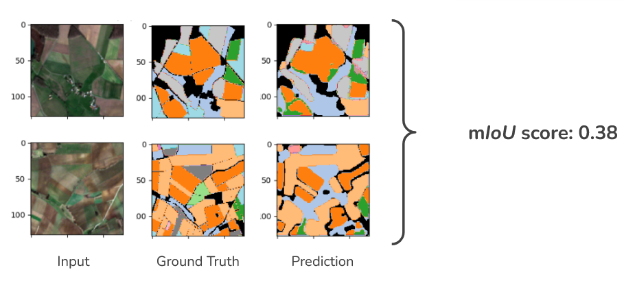

# Segment agricultural parcels from satellite times series (Capgemini x Mines de Paris Hackathon 2024)

As a student at Ecole des Mines de Paris, I had the opportunity to participate to this challenge proposed by Capgemini Invent in 2024

## Challenge description

In this competition, you will face the task of segmenting time series of satellite images to predict the type of crop being grown on various agricultural parcels. The time series data reflects changes in crop appearance throughout the growing season, and your model will need to capture these dynamics to produce accurate predictions.

This challenge will test your ability to work with time series data, satellite imagery, and geospatial analytics, offering a unique and meaningful opportunity to contribute to an important cause while honing your technical skills.

### Data
The challenge is based on the Sentinel-2 data from the PASTIS dataset from Vivien Sainte Fare Garnot and Loic Landrieu.
Input: sequences of T satellite images, centered on ~1km x ~1km zones.

    Each image is of shape (10, 128, 128) (channel-first convention), i.e. the images are (128, 128) and have 10 channels.
    Within a sequence, the images are already centered on the same point. Within a sequence, pixels at the same location point to the same parcels.
    Due to external factors, some sequences have more images than others, i.e. T varies.

Output: The ground truth (the target) is a semantic segmentation mask of the crop types in the images (20 classes)

## Proposed solution
As a first draft, we first tried to segment using a single image instead of the time sequence in order to tackle the heterogeneous data issue and. We selected an image of the month of August as it has more chance of having good weather and being free of clouds. We first started with a simple U-NET and reached an meanIoU score of 10%. This bad result confirms the importance of using temporal information for this crop type segmentation task.

### Preprocessing
The samples are first prepocessed to reduce dimensionality and uniformize between the different samples that can have various number T of acquisition times.
The preprocessing chosen is pretty simple due to time constraints. It consists in having one image per month where for each pixel the computed is the median value on images from the same month.
We obtain (12,10,128,128) size tensors from (T,10,128,128) tensors.
Despite its simplicity this preprocessing can filter out images perturbations and extremal values caused by clouds for instance.

### Model
The proposed model consists in a 3D U-NET that inputs a tensor of shape (12,10,128,128) and outputs a (12,20,128,128) shape tensor. Ideally, we would have wanted a (20,128,128) shaped output to provide a multiclass segmentation output however the architecture used doesn't allow such output shape. Thus we trained it on (20, 128, 128) labels repeated 12 times to have a (12, 20, 128, 128) target. For inference, we then take the max on each pixel over the 20 classes of the output.

### Results
For the mean Intersection over Union (mIoU) metrics we obtain a score of 38% on the test dataset.
This can be seen as a relatively poor score but the metric used is kinda hard and the state-of-the-art models don't go above 70%. 
The image below provides a visual idea of how good our segmentation performs.

Key resources

    Dataset : https://github.com/VSainteuf/pastis-benchmark
    Kaggle competition: https://www.kaggle.com/competitions/data-challenge-invent-mines-2024
    Competition repo: https://github.com/LouisStefanuto/hackathon-mines-invent-2024/tree/main
    U-Net: https://github.com/hamdaan19/UNet-Multiclass/tree/main
